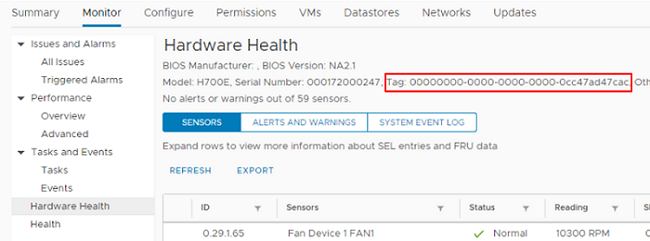
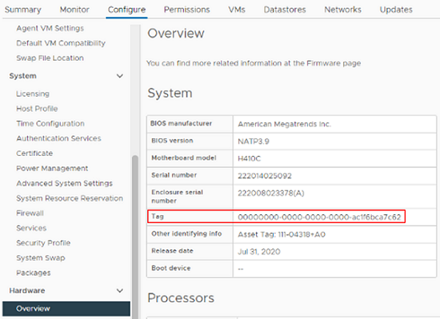

= How to locate a hardware tag for a compute node

:hardbreaks:
:nofooter:
:icons: font
:linkattrs:
:imagesdir: ../media/

[.lead]
You require the hardware tag to add your compute node assets to the management node configuration using the REST API UI.

This section shows you how to locate the hardware tag for your compute node.

.Steps
. Select the host in the vSphere Web Client navigator.
. Select the *Monitor* tab, and select *Hardware Health*.
+
. Depending on the version of vSphere that you are running, you can locate the hardware tag in one of the following locations on the *Hardware Health* screen.

** Check if the tag is listed with the BIOS manufacturer and model number.
+

+
** Select the *Configure* tab. From the sidebar, select *Hardware* and *Overview*. Check if the hardware tag is listed in the `System` table.
+

+
. Copy and save the value for `Tag`.
. To add your compute node asset to the management node, go to xref:task_mnode_add_assets.adoc[Add compute and controller assets to the management node].

// Doc-3482 06/09/2021
