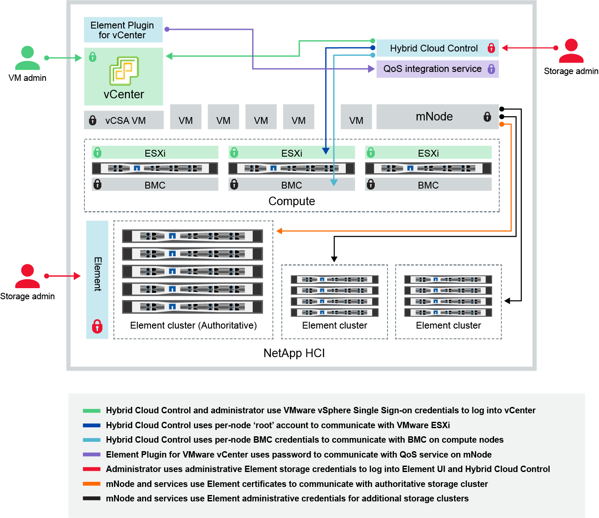

= Change credentials in NetApp HCI and NetApp SolidFire
:icons: font
:imagesdir: ../media/

[.lead]
Depending on the security policies in the organization that deployed NetApp HCI or NetApp SolidFire, changing credentials or passwords is commonly part of the security practices. Before you change passwords, you should be aware of the impact on other software components in the deployment.

If you change credentials for one component of a NetApp HCI or NetApp SolidFire deployment, the following table provides guidance as to the impact on other components.

NetApp HCI component interactions:

[options="header",cols="10a,60a,30a"]
|===
| Credential Type and Icon
| Usage by Admin
| See these instructions

a| Element credentials

a| *Applies to*:  NetApp HCI and SolidFire

Admins use these credentials to log into:

* Element user interface on the Element storage cluster
* Hybrid Cloud Control on the management node (mnode)

When Hybrid Cloud Control manages multiple storage clusters, it accepts only the admin credentials for the storage clusters, known as the _authoritative cluster_ that the mnode was initially set up for. For storage clusters later added to Hybrid Cloud Control, the mnode securely stores admin credentials. If credentials for subsequently added storage clusters are changed, the credentials must also be updated in the mnode using the mnode API.  a|
* https://docs.netapp.com/us-en/element-software/storage/concept_system_manage_manage_cluster_administrator_users.html[Update the storage cluster admin passwords^].
* Update the storage cluster admin credentials in the mnode using the https://docs.netapp.com/us-en/element-software/api/reference_element_api_modifyclusteradmin.html[modifyclusteradmin API^].

|
vSphere Single Sign-on credentials

   a| *Applies to*:  NetApp HCI only

Admins use these credentials to log into the VMware vSphere Client. When vCenter is part of the NetApp HCI installation, credentials are configured in the NetApp Deployment Engine as the following:

* username@vsphere.local with the specified password, and
* administrator@vsphere.local with the specified password.
When an existing vCenter is used to deploy NetApp HCI, the vSphere Single Sign-on credentials are managed by the IT VMware admins.

| https://docs.netapp.com/us-en/hci/docs/task_hci_credentials_vcenter_esxi.html#%20update-the-esxi-password-by-using-the-management-node-rest-api[Update vCenter and ESXi credentials]. 

| Baseboard management controller (BMC) credentials

| *Applies to*: NetApp HCI only

Administrators use these credentials to log in to the BMC of the NetApp compute nodes in a NetApp HCI deployment. The BMC provides basic hardware monitoring and virtual console capabilities.

BMC (sometimes referred to as _IPMI_) credentials for each NetApp compute node are stored securely on the mnode in NetApp HCI deployments. NetApp Hybrid Cloud Control uses  BMC credentials in a service account capacity to communicate with the BMC in the compute nodes during compute node firmware upgrades.

When the BMC credentials are changed, the credentials for the respective compute nodes must be updated also on the mnode to retain all Hybrid Cloud Control functionality.

a| * link:https://docs.netapp.com/us-en/hci/docs/hci_prereqs_final_prep.html[Configure IPMI for each node on NetApp HCI].
* For H410C, H610C, and H615C nodes, link:https://docs.netapp.com/us-en/hci/docs/hci_prereqs_final_prep.html[change default IPMI password].
* For H410S and H610S nodes, https://docs.netapp.com/us-en/element-software/storage/task_post_deploy_credential_change_ipmi_password.html[change default IPM password^].
* link:https://docs.netapp.com/us-en/hci/docs/task_hcc_edit_bmc_info.html[Change BMC credentials on the management node^].

| ESXi credentials

| *Applies to*: NetApp HCI only

Admins can log into ESXi hosts using either SSH or the local DCUI with a local root account. In NetApp HCI deployments, the username is 'root' and the password was specified during the initial installation of that compute node in NetApp Deployment Engine.

ESXi root credentials for each NetApp compute node are stored securely on the mnode in NetApp HCI deployments. NetApp Hybrid Cloud Control uses the credentials in a service account capacity to communicate with ESXi hosts directly during compute node firmware upgrades and health checks.

When the ESXi root credentials are changed by a VMware admin, the credentials for the respective compute nodes must be updated on the mnode to retain Hybrid Cloud Control functionality.

| link:https://docs.netapp.com/us-en/hci/docs/task_hci_credentials_vcenter_esxi.html[Update credentials for vCenter and ESXi hosts^].

| QoS integration password

a| *Applies to*: NetApp HCI and optional in SolidFire

Not used for interactive logins by admins.

The QoS integration between VMware vSphere and Element Software is enabled via:

* Element Plug-in for vCenter Server, and
* QoS service on the mnode.

For authentication, the QoS service uses a password that is exclusively used in this context. The QoS password is specified during the initial installation of the Element Plug-in for vCenter Server, or auto-generated during NetApp HCI deployment.

No impact on other components.

|link:https://docs.netapp.com/us-en/vcp/vcp_task_qossioc.html[Update QoSSIOC credentials in the NetApp Element Plug-in for vCenter Server^]. 

The VCP SIOC password is also known as the _QoSSIOC password_. 

Review the link:https://kb.netapp.com/Advice_and_Troubleshooting/Data_Storage_Software/Element_Plug-in_for_vCenter_server/mNode_Status_shows_as_'Network_Down'_or_'Down'_in_the_mNode_Settings_tab_of_the_Element_Plugin_for_vCenter_(VCP)[Element Plug-in for vCenter Server KB article^].

| vCenter Service Appliance credentials

| *Applies to*: NetApp HCI only if set up by NetApp Deployment Engine

Admins can log into the vCenter Server appliance virtual machines. In NetApp HCI deployments, the username is 'root' and the password was specified during the initial installation of that compute node in the NetApp Deployment Engine. Depending on the VMware vSphere version deployed, certain admins in the vSphere Single Sign-on domain can also log in to the appliance.

No impact on other components.
| No changes needed. 

| NetApp Management Node admin credentials

| *Applies to*: NetApp HCI and optional in SolidFire

Admins can log into the NetApp management node virtual machines for advanced configuration and troubleshooting. Depending on the management node version deployed, login via SSH is not enabled by default.

In NetApp HCI deployments, the username and  password was specified by the user during the initial installation of that compute node in NetApp Deployment Engine.

No impact on other components.

| No changes needed. 
|===

== Find more information
* https://docs.netapp.com/us-en/element-software/storage/reference_post_deploy_change_default_ssl_certificate.html[Change the Element software default SSL certificate^]
* https://docs.netapp.com/us-en/element-software/storage/task_post_deploy_credential_change_ipmi_password.html[Change the IPMI password for nodes^]
* https://docs.netapp.com/us-en/element-software/storage/concept_system_manage_mfa_enable_multi_factor_authentication.html[Enable multi-factor authentication^]
* https://docs.netapp.com/us-en/element-software/storage/concept_system_manage_key_get_started_with_external_key_management.html[Get started with external key management^]
* https://docs.netapp.com/us-en/element-software/storage/task_system_manage_fips_create_a_cluster_supporting_fips_drives.html[Create a cluster supporting FIPS drives^]
